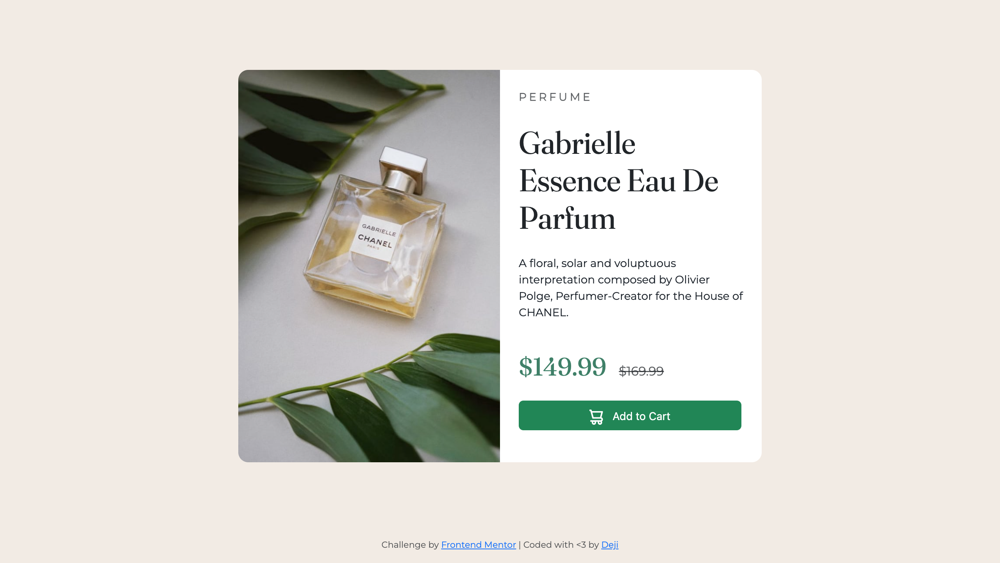

# Frontend Mentor - Product preview card component solution

This is a solution to the [Product preview card component challenge on Frontend Mentor](https://www.frontendmentor.io/challenges/product-preview-card-component-GO7UmttRfa). Frontend Mentor challenges help you improve your coding skills by building realistic projects. 

## Table of contents

- [Overview](#overview)
  - [The challenge](#the-challenge)
  - [Screenshot](#screenshot)
  - [Links](#links)
- [Author](#author)

## Overview

### The challenge

Users should be able to:

- View the optimal layout depending on their device's screen size
- See hover and focus states for interactive elements

### Screenshot

### Links

- Solution URL: [Solution URL here](https://github.com/deji-dd/Product-Preview-Card-Component)
- Live Site URL: [Live site URL here](https://deji-dd.github.io/Product-Preview-Card-Component/)

## Author

- Website - [Deji](https://deji-dd.github.io/Deji/)
- Frontend Mentor - [@deji-dd](https://www.frontendmentor.io/profile/deji-dd)
